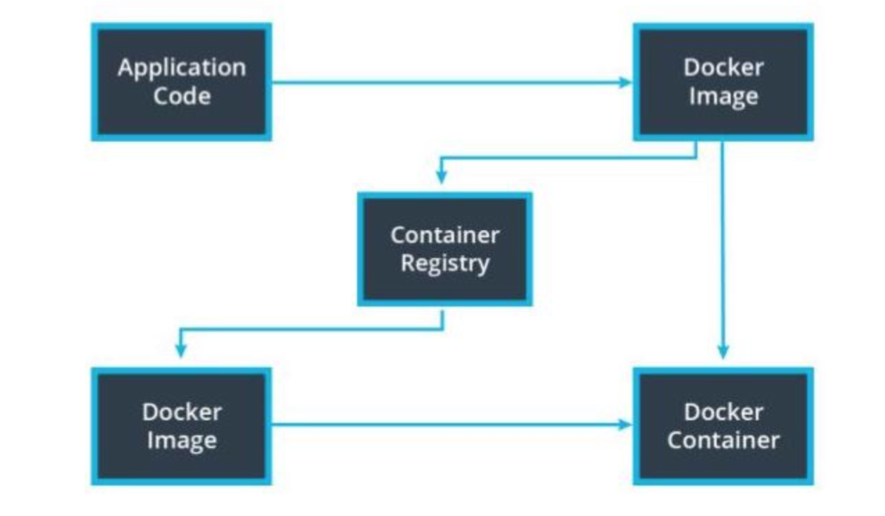

# 4. Monolith to Microservices 
___
* New content 

## Lesson 3: Containers Using Docker

### 11. Container Registries

### Container Registry
* A container registry serves as a centralized place for us to store and version our images.

### DockerHub
* DockerHub is a popular container registry run by the same organization that created Docker.

### Base Images
* Base images reduce time that it takes to run redundant operations.

___

#### Container registeries serve as a centralized source of our Docker images

### Additional Reading
Here are some more reading materials that you can reference for improving how Docker is used in a production system.

* [Docker Registry](https://docs.docker.com/registry/)
* [Best practices for speeding up builds](https://cloud.google.com/cloud-build/docs/speeding-up-builds)