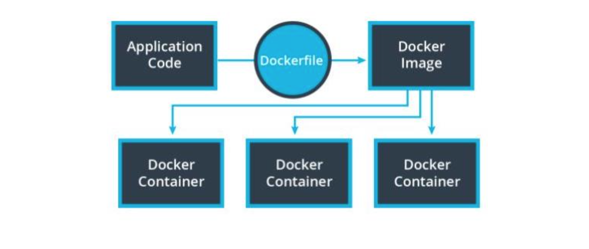

# 4. Monolith to Microservices 
___
* New content 

## Lesson 3: Containers Using Docker

### 3. Docker



### Overview
Docker is a platform that helps us manage the process of creating and managing our containers.

### Docker Image
When we have an application that we want to deploy, we can package it into a Docker Image. The image contains all of your code and dependencies.

### Docker Container
A Docker Container is an ephemeral running instance of a Docker Image.

### Dockerfile
A Dockerfile defines the steps to create a Docker Image.

#### Sample Dockerfile

``` python
# Use NodeJS base image
FROM node:13

# Create app directory in Docker
WORKDIR /usr/src/app

# Install app dependencies by copying
# package.json and package-lock.json
COPY package*.json ./

# Install dependencies in Docker
RUN npm install

# Copy app from local environment into the Docker image
COPY . .

# Set the API’s port number
EXPOSE 8080

# Define Docker’s behavior when the image is run
CMD ["node", "server.js"]

```
### Basic Commands:
`docker build .` will run the Dockerfile to create an image
`docker images` will print all the available images
`docker run {IMAGE_ID}` will run a container with the image
`docker ps` will print all the running containers
`docker kill {CONTAINER_ID}` will terminate the container

### Key Terms - Docker
| **Term**    |  **Definition** |
| :---        |        :----:   |
|  Base Image  |  A set of common dependencies built into a Docker image that acts as a starting point to build an application’s Docker images to reduce build times          | 
|   Container	 |    Grouped software dependencies and packages that make it easier and more reliable to deploy software        | 
|  Container Registry |  A centralized place to store container images|
| Docker-compose  | A tool used to run multiple Docker containers at once; often used to specify dependent relationships between containers |
| Dockerfile  | A file containing instructions on how to translate an application into an image that can be run in containers |
| Ephemeral| Software property where an application is expected to be short-lived |
| Image | A snapshot of dependencies and code used by Docker containers to run an application |


	            
	                 
                 
	                     
___

#### Further Optional Research on Docker
*Dockerfiles* are very open-ended and can become very messy very quickly. The following is an article on some best practices for writing Dockerfiles:

* [Best practices for writing Dockerfiles](https://docs.docker.com/develop/develop-images/dockerfile_best-practices/)