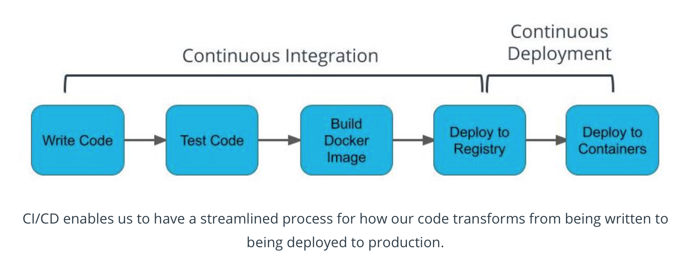

# 4. Monolith to Microservices 
___
* New content 

## Lesson 4: Auomating the Application Development Lifcycle 

### 4. CI/CD Benefits

### Continuous Integration
Process in which code is tested, built into a Docker image, and deployed to a container registry.

### Continuous Deployment
Process in which our Docker image is deployed to containers.

### Additional Benefits
By streamlining our build and deploy to an automated process, developers are provided the least privilege that they need to write their code.

| **Term**    |  **Definition** |
| :---        |        :----:   |
|  Continuous Integration | practice of streamlining developer code to a centralized source      |
|  Continuous Deployment  |  practice of streamlining how code is released    |
| Least Privileged Access  |  providing the least amount of permissions necessary    |
___
### Additional Reading
The following information is available for further reading on key ideas for deploying code.

* [Ship Early and Often](https://blog.ycombinator.com/tips-ship-early-and-often/)

