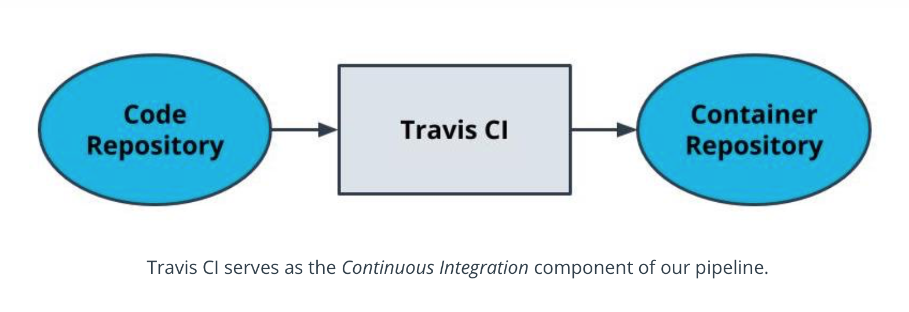

# 4. Monolith to Microservices 
___
* New content 

## Lesson 4: Auomating the Application Development Lifcycle 


### 8. Using Travis CI

* Travis is a tool that helps us with the CI process
* Travis integrates with your application using a  YAML file
* YAML files are often used to specify configurations.
* Travis can be used to build and push images to DockerHub

### YAML
YAML is similar to how JSON is also used as a representation of data but YAML is considered more readable.

* YAML is generally suited for configuration files
* YAML is generally suited for expressing data.


When used as configurations, they are often interchangeable. The examples below show how a YAML file can be represented as JSON.

```JSON
{
    “course_name”: “Making More Microservices”,
    “num_students”: 10,
    “lessons”: {
        “ci”: {
            “num_students”: 6
         },
        “cd”: {
        “num_students”: 4
        }
    }
}

``` 

``` 
course_name: Making More Microservices
num_students: 10
lessons:
  ci:
    num_students: 6
  cd:
    num_students: 4
```

### Travis File
The Travis file is always named .travis.yaml and stored in the top-level of your git directory. This is detected by Travis CI and turned into a build pipeline.

```yaml
language: node_js
node_js:
  - 13

services:
  - docker

# Pre-testing installs
install:
  - echo "nothing needs to be installed"

# Scripts to be run such as tests
before_script:
  - echo "no tests"

script:
  - docker --version # print the version for logging
  - docker build -t simple-node .
  - docker tag simple-node YOUR_DOCKER_HUB/simple-node:latest

# Tasks to perform after the process is successful. Formatting the Docker username and password as below enables you to programmatically log in without having the password exposed in logs.
after_success:
  - echo "$DOCKER_PASSWORD" | docker login -u "$DOCKER_USERNAME" --password-stdin
  - docker push YOUR_DOCKER_HUB/simple-node

```



| **Term**    |  **Definition** |
| :---        |        :----:   |
|  YAML | *Yet another markup language*  a common way to programmatically write configurations. Sometimes referred to as YML.    |
___

### Additional Reading
For more details about Travis CI functionality:

* [Travis CI Features](https://docs.travis-ci.com/user/for-beginners/)

