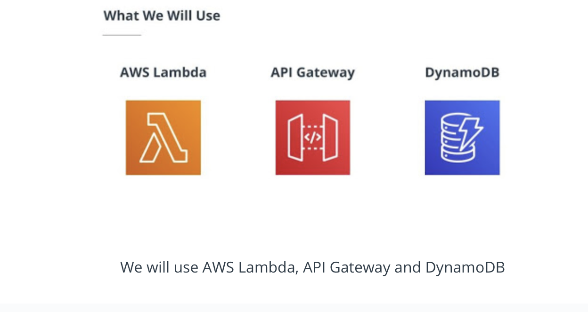

# 5. Develop & Deploy Serverless App
___

## Lesson 2: Rest API 

### 1. Introduction 

This lesson will cover:

* Develop REST API for group of images.
* Store data in DynamoDB
* Build a web application using React framework to use our application.

